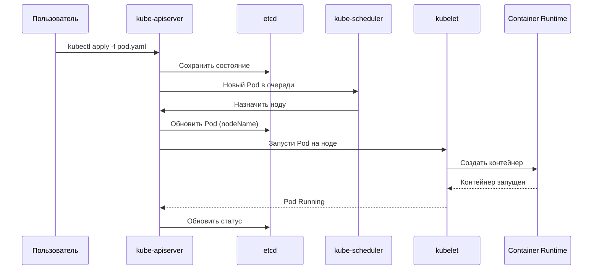

# Kubernetes (K8s)

**Kubernetes** — это оркестратор контейнеров: система, которая автоматизирует развёртывание, масштабирование и управление контейнеризированными приложениями.

**Зачем нужен:**
- Управляет контейнерами на множестве хостов (кластер)
- Автоматически восстанавливает упавшие Pod'ы
- Балансирует нагрузку
- Масштабирует приложения
- Управляет обновлениями без простоя

##  Архитектура кластера

Кластер Kubernetes состоит из двух типов узлов:

**🧠 Control Plane (Управляющий слой)** - "мозг" кластера. Принимает решения о том, где и что запускать

| Компонент                 | Роль                                                                                       | Почему это важно для DevOps                                                                                          |
|---------------------------|--------------------------------------------------------------------------------------------|----------------------------------------------------------------------------------------------------------------------|
| **kube-apiserver**        | Единая точка входа (REST API). Принимает команды от kubectl, CI/CD, веб-интерфейса.        | Все операции проходят через него. Масштабируется горизонтально за load balancer.                                     |
| **etcd**                  | Распределённое Key-Value хранилище (на базе Raft). Хранит всё состояние кластера.          | Критичный компонент! Бэкапы etcd = бэкап всего кластера. Только apiserver пишет в etcd.                              |
| **kube-scheduler**        | Решает, на какой узел запустить новый Pod (на основе CPU, RAM, affinity, taints).          | Можно писать кастомные scheduler'ы под специфичные задачи.                                                           |
| **kube-controller-manager** | Набор контроллеров: Node Controller, Replication Controller, Endpoints Controller и др.  | Реализует логику «самоисцеления»: упал Pod → контроллер создаёт новый.                                               |
| **cloud-controller-manager** | Интеграция с облачными провайдерами (AWS, GCP, Azure): балансировщики, volumes, nodes.   | Позволяет K8s управлять облачными ресурсами через API провайдера.                                                    |

### 📌 Что такое контроллер
**Контроллер** — это компонент Control Plane, который следит за состоянием ресурсов и приводит реальное состояние к желаемому.

| Контроллер   | Главная задача                                          |
|--------------|---------------------------------------------------------|
| Deployment   | Управляет ReplicaSet'ами, обновлениями и откатами       |
| ReplicaSet   | Гарантирует N Pod'ов                                    |
| StatefulSet  | Даёт Pod'ам идентичность, порядок и свои диски          |
| DaemonSet    | Запускает Pod на каждой ноде                            |

**Главное правило:**
- Stateless → Deployment
- Stateful → StatefulSet
- На каждой ноде → DaemonSet

### Ключевые особенности
- **Control Plane** не запускает пользовательские Pod'ы
- Если Control Plane упал — кластер продолжает работать, но **нельзя управлять**
- **etcd** — единственное stateful-хранилище в кластере

**👷 Worker Nodes** - "руки" кластера. Здесь запускаются контейнеры.

| Компонент             | Роль                                                                                                          | DevOps Notes                                                                                                                  |
|-----------------------|---------------------------------------------------------------------------------------------------------------|-------------------------------------------------------------------------------------------------------------------------------|
| **kubelet**           | Агент на каждом узле. Получает инструкции от API Server и управляет контейнерами через container runtime.     | «Страж» узла. Отправляет heartbeats. Если kubelet упал — нода становится `NotReady`.                                            |
| **kube-proxy**        | Сетевой прокси. Реализует абстракцию Service: настраивает iptables/IPVS правила для маршрутизации трафика.    | Отвечает за L4 load balancing внутри кластера. Работает в режимах: iptables (default), ipvs, userspace.                        |
| **Container Runtime** | ПО для запуска контейнеров: containerd, CRI-O, Docker (через shim).                                           | K8s общается через CRI (Container Runtime Interface). 
| **Pod**               | Минимальная единица развёртывания. Один или несколько контейнеров с общими network/storage namespaces.        | Минимальный единица. Pod — это не контейнер! Pod может содержать sidecar-контейнеры (логирование, proxy)

### Ключевые особенности
- **Worker Nodes** не принимают решений — только выполняют
- Каждая нода имеет **kubelet**, который общается с Control Plane
- Если нода упала — Control Plane **пересоздаст** Pod'ы на других нодах

Пошагово:

1. **Пользователь** отправляет манифест через `kubectl`
2. **kube-apiserver** принимает запрос и сохраняет в **etcd**
3. **kube-scheduler** видит новый Pod и выбирает ноду
4. **kube-apiserver** обновляет Pod с назначенной нодой
5. **kubelet** на этой ноде получает команду
6. **Container Runtime** создаёт контейнер
7. **kubelet** сообщает статус обратно в **API Server**

## 📦 Pod — минимальная единица
Pod — это группа из одного или нескольких контейнеров, которые:
- Работают на одной ноде
- Разделяют сеть (один IP)
- Разделяют тома (хранилище)
- Запускаются и умирают вместе

Стадии жизненного цикла Pod:

| Стадия               | Что происходит                                                        |
|----------------------|------------------------------------------------------------------------|
| **Pending**          | Pod создан, но ещё не запущен (ждёт ноду, скачивает образ)            |
| **ContainerCreating**| Контейнеры создаются                                                   |
| **Running**          | Pod запущен, контейнеры работают                                       |
| **Terminating**      | Pod удаляется                                                          |
| **Succeeded**        | Все контейнеры завершились успешно (для Job)                           |
| **Failed**           | Хотя бы один контейнер упал                                            |

## Kubernetes Troubleshooting

| #  | Проблема                                              | Компонент                              | Где проверять                                                                              | Возможные причины / действия                                                                                     |
|----|-------------------------------------------------------|----------------------------------------|--------------------------------------------------------------------------------------------|------------------------------------------------------------------------------------------------------------------|
| 1  | `kubectl` не отвечает, `connection refused` на :6443  | kube-apiserver                         | Логи API-сервера (`journalctl -u kube-apiserver`), статус пода/контейнера                  | Процесс упал, порт 6443 закрыт, сертификаты истекли, проблемы сети, ресурсы ноды                                 |
| 2  | Высокая задержка при работе с `kubectl`               | kube-apiserver                         | Логи apiserver, нагрузка на CPU, размер etcd                                               | `kubectl` общается с API Server — если он тормозит, тормозит всё                                                 |
| 3  | `kubectl` возвращает "connection refused"             | kube-apiserver / kubeconfig            | Проверить kubeconfig, статус apiserver                                                     | `kubectl` не может подключиться к API Server                                                                     |
| 4  | Control Plane недоступен (все ноды `NotReady`)        | kube-apiserver / etcd / сеть           | Логи apiserver, etcd, `kubectl cluster-info`                                               | Без Control Plane кластер не управляется                                                                        |
| 5  | Невозможность создавать Pod/Service, потеря конфигураций | etcd                                | Логи etcd, состояние кворума (`etcdctl endpoint status`), бэкапы                            | Недоступность кворума, диск переполнен, повреждение данных                                                       |
| 6  | etcd тормозит / ошибки                                | etcd                                   | Логи etcd, размер БД, latency диска                                                        | etcd — хранилище всего состояния кластера                                                                        |
| 7  | Новые поды остаются в `Pending`                       | kube-scheduler                         | `kubectl describe pod` (Events), ресурсы нод                                               | Недостаточно ресурсов (CPU/Memory), строгие affinity/anti-affinity, taints/tolerations mismatch                 |
| 8  | Deployment не масштабируется, поды не восстанавливаются | kube-controller-manager              | Логи controller-manager, события в кластере, статус контроллеров                           | Контроллер не видит состояния через API Server, сбой компонента, ошибки конфигурации Deployment/ReplicaSet       |
| 9  | Deployment не создаёт Pod'ы                           | kube-controller-manager                | Логи controller-manager, `kubectl describe deployment`                                     | Контроллеры создают ReplicaSet → Pod'ы                                                                           |
| 10 | HPA не масштабирует                                   | metrics-server / HPA controller        | `kubectl get hpa`, `kubectl top pod`, логи metrics-server                                  | Нет метрик (metrics-server не работает) или неверные пороги                                                      |
| 11 | Создание/удаление VM, балансировщиков, дисков не происходит | cloud-controller-manager          | Логи CCM, состояние облачных ресурсов                                                      | Проблемы с API облачного провайдера, неверные креды/токены, ошибки конфигурации cloud provider                   |
| 12 | Node в состоянии `NotReady`                           | kubelet                                | `systemctl status kubelet`, логи kubelet, `kubectl get nodes`                              | Процесс упал, нехватка ресурсов, ошибки сети/сертификатов, storage pressure                                       |
| 13 | Node не может присоединиться к кластеру               | kubelet                                | Логи kubelet, токен bootstrap, сертификаты                                                 | kubelet регистрируется через API Server                                                                          |
| 14 | Pod не стартует, контейнеры падают                    | Container Runtime                      | Логи CRI (containerd / CRI-O), `docker ps` / `ctr` / `crictl ps`                           | Runtime не запущен, повреждён образ, проблемы cgroups или storage                                                |
| 15 | Pod в `CrashLoopBackOff`                              | Container Runtime / приложение         | `kubectl logs`, `kubectl describe pod`                                                     | Контейнер запускается и сразу падает — проблема в приложении или runtime                                         |
| 16 | OOMKilled (контейнер убит по памяти)                  | Container Runtime / cgroups            | `kubectl describe pod` (Reason: OOMKilled), `kubectl top pod`                              | Превышен memory limit → ядро убивает процесс                                                                     |
| 17 | ImagePullBackOff / ErrImagePull                       | kubelet / Container Runtime            | `kubectl describe pod`, логи kubelet, доступность registry                                 | Неверный образ, нет доступа к registry, проблемы с imagePullSecrets                                             |
| 18 | Pod evicted (вытеснен)                                | kubelet / ресурсы ноды                 | `kubectl describe pod`, `kubectl get events`, `df -h`, `free -m`                           | Нехватка ресурсов (disk pressure, memory pressure) → kubelet вытесняет поды                                      |
| 19 | Pod не получает IP-адрес                              | CNI-плагин (kindnet, Calico, Cilium)   | Логи CNI, `kubectl describe pod` (события)                                                 | IP выдаёт CNI. Если CNI не работает — Pod'ы без сети                                                             |
| 20 | Pod не может подключиться к другому Pod               | CNI-плагин / kube-proxy                | `kubectl exec` + ping/curl, логи CNI                                                       | Сеть между Pod'ами обеспечивает CNI                                                                              |
| 21 | Network Policy блокирует трафик                       | CNI (Calico, Cilium)                   | `kubectl describe networkpolicy`, логи CNI                                                 | Network Policy может блокировать трафик между подами                                                            |
| 22 | Service недоступен по ClusterIP / LoadBalancer        | kube-proxy                             | Логи kube-proxy, iptables/IPVS правила, CNI-плагины                                        | kube-proxy не работает, ошибки iptables/IPVS, конфликт CNI, маршрутизация сломана                                |
| 23 | Service не балансирует трафик                         | kube-proxy / Endpoints                 | `kubectl get endpoints`, iptables/IPVS, логи kube-proxy                                    | Пустые Endpoints или сломанные правила → трафик не доходит до подов                                             |
| 24 | DNS не работает внутри Pod                            | CoreDNS                                | Логи CoreDNS, `kubectl exec` + `nslookup`                                                  | CoreDNS — DNS-сервер кластера                                                                                    |
| 25 | Ingress не маршрутизирует                             | Ingress Controller (nginx-ingress)     | Логи ingress-controller, `kubectl describe ingress`                                        | Ingress Controller обрабатывает HTTP-маршруты                                                                    |
| 26 | PVC не может подключиться                             | StorageClass / CSI-драйвер             | `kubectl describe pvc`, логи CSI                                                           | PVC запрашивает PV через StorageClass                                                                            |
| 27 | Pod не монтирует Volume                               | kubelet / CSI / StorageClass           | `kubectl describe pod`, логи CSI, `kubectl get pv,pvc`                                     | Ошибка монтирования, недоступность хранилища, неверный StorageClass                                             |
| 28 | Secret не доступен / не монтируется в Pod             | kubelet / API Server / RBAC            | `kubectl describe pod`, права RBAC                                                         | API Server выдаёт Secret, RBAC контролирует доступ, kubelet монтирует в Pod                                     |
| 29 | Сертификаты истекли                                   | kube-apiserver / kubelet / etcd        | `kubeadm certs check-expiration`, логи компонентов                                         | Истёкшие сертификаты → компоненты не могут общаться друг с другом                                               |
| 30 | Часы на нодах расходятся                              | NTP / chrony                           | `timedatectl`, `chronyc tracking`                                                          | Рассинхрон времени ломает TLS и работу etcd                                                                      |
| 31 | Node перезагружается / kernel panic                   | ОС ноды / hardware                     | `dmesg`, `journalctl -k`, логи системы                                                     | Аппаратные сбои, OOM на уровне ОС, проблемы с ядром                                                             |

## Разбор видов ресурсов

`kind: Pod`
**Что это:** Минимальная единица развёртывания в Kubernetes. Один или несколько контейнеров с общими network/storage namespaces.
**Когда использовать:** Только для отладки, тестов, одноразовых задач. В продакшене — через контроллеры (Deployment, StatefulSet, DaemonSet).

`kind: Deployment`
**Что это:** Контроллер, который управляет ReplicaSet, а тот — Pods. Обеспечивает декларативное обновление и масштабирование.
**Когда использовать:** Для stateless приложений (API, frontend, workers), которые можно масштабировать горизонтально.

`kind: Service`
**Что это:** Абстракция, которая даёт стабильную точку доступа к группе Pod'ов (обычно управляемых Deployment).
**Когда использовать:** Всегда, когда нужно дать доступ к Pod'ам (внутри или снаружи кластера).

`kind: ConfigMap`
ConfigMap предназначен для хранения нечувствительных конфигурационных данных

`kind: Secret`
Если ConfigMap предназначен для обычной конфигурации, то Secret используется для хранения чувствительных данных: паролей, токенов, ключей.

## 📋 Сводная таблица

| Характеристика        | Pod              | Deployment              | Service                        |
|-----------------------|------------------|-------------------------|--------------------------------|
| **Уровень**           | Контейнер(ы)     | Контроллер              | Абстракция сети                |
| **Создаёт**           | —                | ReplicaSet → Pods       | — (только маршрутизирует)      |
| **Стабильный IP/DNS** | ❌ Нет           | ❌ Нет                  | ✅ Да (ClusterIP + DNS)        |
| **Self-healing**      | ❌ Нет           | ✅ Да                   | ❌ Нет                         |
| **Масштабирование**   | ❌ Вручную       | ✅ Да (replicas)        | ❌ Нет                         |
| **Rolling update**    | ❌ Нет           | ✅ Да                   | ❌ Нет                         |
| **Поиск Pod'ов**      | —                | По labels (свои)        | По labels (selector)           |
| **Когда использовать**| Отладка, тесты   | Stateless-приложения    | Доступ к Pod'ам                |

## Endpoints

`Endpoints` и `EndpointSlice` — это служебные ресурсы Kubernetes, которые содержат реальные IP-адреса и порты подов, подходящих под селектор сервиса. Проще говоря:
- *Service* — логическое описание точки доступа;
- `Endpoints/EndpointSlice` — конкретный список адресов, куда пойдёт трафик.

`Endpoints` и `EndpointSlice` — это динамические ресурсы. Kubernetes автоматически обновляет их при любых изменениях в кластере: при масштабировании Deployment, при падении или удалении подов.

**Endpoints** — это устаревший объект, который раньше хранил список IP-адресов и портов Pod'ов, соответствующих Service'у. 
**EndpointSlice** — это его современная замена, которая решает проблемы масштабируемости и поддерживает новые функции.

Когда вы создаете **Service** с селектором (`selector`), Kubernetes автоматически находит все Pod'ы, которые соответствуют этому селектору, и создает объекты, содержащие их IP-адреса. Эти объекты и есть Endpoints / EndpointSlice .
Проще говоря:
- **Service** — это «виртуальный» адрес и правила балансировки.
- **EndpointSlice** — это реальный список IP-адресов и портов здоровых Pod'ов, которые стоят за этим Service'ом .

## Управление хранилищем: Volume в Kubernetes

Volume в Kubernetes — это механизм хранения данных, который не зависит от жизненного цикла контейнеров в поде. Volume создаётся на уровне пода и может быть доступен одновременно нескольким контейнерам внутри него. Он обеспечивает постоянное хранение данных даже при перезапуске контейнеров.

**Основные типы Volume**:

- `emptyDir` — временный том, создаваемый при запуске пода и уничтожаемый при его остановке (хранения временных файлов и промежуточных данных)

- `hostPath` — доступ к файлам на хост-машине, где запущен под (создаёт зависимость от конкретного узла, почти никогда не используется в продакшне)

- `PersistentVolume` — постоянный том уровня кластера; его данные сохраняются, даже если под пересоздан или перенесён на другую ноду. Это фрагмент хранилища в кластере, созданный администратором. Это абстракция хранилища, которая не привязана к подам и существует независимо от их жизненного цикла. PV — это ресурс кластера, который представляет собой физическое хранилище. Создаётся администратором или динамически.
PVC (`PersistentVolumeClaim`) — это запрос Pod'а на хранилище. Pod не использует PV напрямую — он использует PVC.

- `ConfigMap` и `Secret` — специальные типы для конфигурационных данных.

*Теперь у вас есть все ключевые строительные блоки Kubernetes:*

- Deployment управляет подами,
- Service даёт стабильный доступ,
- ConfigMap и Secret управляют конфигурацией,
- Volume и PVC обеспечивают сохранность данных.

## 📌 Просмотр ресурсов

| Команда                              | Что делает                     |
|--------------------------------------|--------------------------------|
| `kubectl get pods`                   | Список Pod'ов                  |
| `kubectl get pods -o wide`           | + IP и NODE                    |
| `kubectl get pvc`                    | Список PVC                     |
| `kubectl get pv`                     | Список PV                      |
| `kubectl get configmap`              | Список ConfigMap               |
| `kubectl get secret`                 | Список Secret                  |
| `kubectl get service`                | Список Service                 |
| `kubectl get deployments`            | Список Deployment              |
| `kubectl get nodes`                  | Список нод                     |
| `kubectl get all`                    | Все ресурсы в namespace        |
| `kubectl get storageclass`           | Список StorageClass            |

## 🔍 Детальная информация

| Команда                                      | Что делает                     |
|----------------------------------------------|--------------------------------|
| `kubectl describe pod <имя>`                 | Детали Pod'а + Events          |
| `kubectl describe pvc <имя>`                 | Детали PVC + Events            |
| `kubectl describe deployment <имя>`          | Детали Deployment              |
| `kubectl describe node <имя>`                | Детали ноды                    |
| `kubectl logs <pod>`                         | Логи контейнера                |
| `kubectl logs <pod> --tail=20`               | Последние 20 строк             |
| `kubectl logs <pod> -f`                      | Логи в реальном времени        |

## 🛠️ Создание и применение

| Команда                                                      | Что делает                        |
|--------------------------------------------------------------|-----------------------------------|
| `kubectl apply -f file.yaml`                                 | Применить манифест                |
| `kubectl apply -f ./folder/`                                 | Применить все манифесты в папке   |
| `kubectl delete -f file.yaml`                                | Удалить по манифесту              |
| `kubectl patch deployment <имя> --patch-file patch.yaml`     | Частично обновить                 |

## 🗑️ Удаление

| Команда                              | Что делает                     |
|--------------------------------------|--------------------------------|
| `kubectl delete pod <имя>`           | Удалить Pod                    |
| `kubectl delete deployment <имя>`    | Удалить Deployment             |
| `kubectl delete pvc <имя>`           | Удалить PVC                    |
| `kubectl delete configmap <имя>`     | Удалить ConfigMap              |
| `kubectl delete -f file.yaml`        | Удалить по манифесту           |
| `kubectl delete all --all`           | Удалить всё в namespace        |

## 🌐 Контексты и namespace

| Команда                                                       | Что делает                     |
|---------------------------------------------------------------|--------------------------------|
| `kubectl config get-contexts`                                 | Список контекстов              |
| `kubectl config current-context`                              | Текущий контекст               |
| `kubectl config use-context <имя>`                            | Переключить контекст           |
| `kubectl config set-context --current --namespace=<ns>`       | Сменить namespace              |
| `kubectl get namespaces`                                      | Список namespace               |

## 🔧 Взаимодействие с Pod'ом

| Команда                                            | Что делает                     |
|----------------------------------------------------|--------------------------------|
| `kubectl exec -it <pod> -- sh`                     | Зайти в Pod                    |
| `kubectl exec -it <pod> -- ls /data`               | Выполнить команду              |
| `kubectl port-forward pod/<pod> 8080:80`           | Проброс порта                  |
| `kubectl port-forward service/<svc> 9090:9090`     | Проброс через Service          |
| `kubectl cp <pod>:/path/file ./file`               | Скопировать файл               |

## 📊 Масштабирование и обновления

| Команда                                                    | Что делает              |
|------------------------------------------------------------|-------------------------|
| `kubectl scale deployment <имя> --replicas=3`              | Масштабировать          |
| `kubectl rollout status deployment <имя>`                  | Статус обновления       |
| `kubectl rollout undo deployment <имя>`                    | Откатить                |
| `kubectl rollout history deployment <имя>`                 | История                 |

# Проверки состояния в Kubernetes (Probes)

Kubernetes должен знать: **жив ли контейнер, готов ли принимать трафик, запустился ли он**. Для этого есть три типа проверок.

## 1️⃣ Startup Probe — «Контейнер запустился?»
Задача: Проверить, что приложение успешно стартовало.

Особенность: Пока Startup Probe не пройдёт — Liveness и Readiness не работают.

## 2️⃣ Readiness Probe — «Готов принимать трафик?»
Задача: Проверить, что контейнер готов обрабатывать запросы.

Особенность: Если Readiness не прошёл — Pod убирается из Service (не получает трафик), но не перезапускается.

## 3️⃣ Liveness Probe — «Контейнер ещё жив?»
Задача: Проверить, что контейнер работает (не завис).

Особенность: Если Liveness не прошёл — контейнер перезапускается.

## ✅ Итог

| Проверка      | Вопрос                        | При неудаче               |
|---------------|-------------------------------|---------------------------|
| **Startup**   | Контейнер запустился?         | Убить контейнер           |
| **Readiness** | Готов принимать трафик?       | Убрать из Service         |
| **Liveness**  | Контейнер жив?                | Перезапустить контейнер   |

Правило:

- **Startup** — для долго стартующих приложений
- **Readiness** — всегда (чтобы не слать трафик в неготовый Pod)
- **Liveness** — для восстановления после зависаний

Без **Readiness** — трафик пойдёт в Pod, который ещё не готов → ошибки 5xx.
Без **Liveness** — зависший Pod останется «живым», но не будет работать.
Без **Startup** — Liveness убьёт Pod, который ещё не успел запуститься. 

# JOB

Job — это контроллер, который запускает Pod'ы до успешного завершения задачи. В отличие от Deployment, где Pod'ы работают постоянно, Job создан для одноразовых задач.

| Ресурс    | Задача                          |
|-----------|---------------------------------|
| **Job**   | Одноразовая задача до завершения |
| **CronJob** | Задача по расписанию          |

Ключевые параметры Job:
- completions — сколько успешных выполнений нужно
- parallelism — сколько Pod'ов одновременно
- backoffLimit — сколько попыток при ошибке
- restartPolicy — Never или OnFailure

Примеры использования:
- Job — миграции БД, batch-обработка
- CronJob — бэкапы, отчёты, очистка

# Troubleshooting (practice)

| Симптом                                      | Ошибка                          | Диагностика                                                                                                                              | Причина                                                                                                      |
|----------------------------------------------|---------------------------------|------------------------------------------------------------------------------------------------------------------------------------------|--------------------------------------------------------------------------------------------------------------|
| **ImagePullBackOff / ErrImagePull**         | Опечатка в `image`              | `kubectl describe pod` → Events: `Failed to pull image ...:1.0.00: not found`                                                            | В `30-frontend-deploy.yaml` указан тег `1.0.00` вместо `1.0.0`                                               |
| **CrashLoopBackOff**                         | Опечатка в `BACKEND_URL`        | `kubectl logs <pod> --previous` → `nginx: [emerg] host not found in upstream "backend-api"`                                              | В `30-frontend-deploy.yaml` указан `BACKEND_URL: "http://backend-api"`, но Service называется `backend`      |
| **CreateContainerConfigError**               | Опечатка в ключе Secret         | `kubectl describe pod` → Events: `couldn't find key auth_secrettypo in Secret`                                                           | В `20-backend-deploy.yaml` указан ключ `auth_secrettypo`, в Secret — `auth_secret`                           |
| **Endpoints пустые**                         | Service selector mismatch       | `kubectl get endpoints backend` → пусто; `kubectl get svc backend -o jsonpath="{.spec.selector}"` → `{"app":"back-end"}`; Pod'ы имеют `app=backend` | В `21-backend-svc.yaml` selector `app: back-end` вместо `app: backend`                                       |
| **Liveness probe failed: connection refused**| Несоответствие портов           | `kubectl logs <pod>` → `backend listening on :3000`; `kubectl get deploy backend -o jsonpath="{...containerPort}"` → `3001`              | В `20-backend-deploy.yaml` `containerPort: 3001`, в `21-backend-svc.yaml` `targetPort: 3001`, а приложение слушает `3000` |
| **CrashLoopBackOff, RESTARTS: 6**            | Слишком агрессивный Liveness Probe | `kubectl describe pod` → Events: `Liveness probe failed, Container failed liveness probe, will be restarted`; `delay=0s, failure=1`     | `initialDelaySeconds: 0` и `failureThreshold: 1` — probe убивает контейнер до старта приложения               |
| **Pod 0/1 Running, Endpoints пустые**        | Readiness Probe 404             | `kubectl describe pod` → `Readiness probe failed: HTTP probe failed with statuscode: 404`; `wget http://localhost:3000/readyz` → `404`   | В `20-backend-deploy.yaml` `readinessProbe.path: /readyz`, но у backend нет такого эндпоинта                 |
| **FailedCreate, Pod'ы не создаются**         | ResourceQuota исчерпана         | `kubectl describe replicaset` → Events: `exceeded quota: requested: requests.cpu=100m, used: requests.cpu=500m, limited: requests.cpu=500m` | Все `500m` CPU заняты старыми Pod'ами `data-init` и `reporter` в статусе `Error`                            |