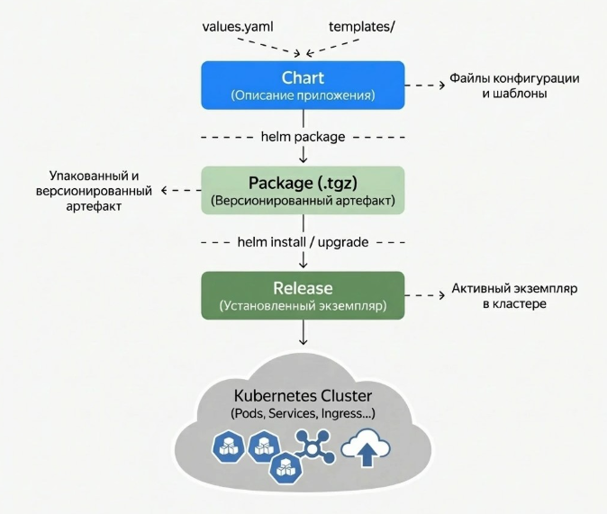
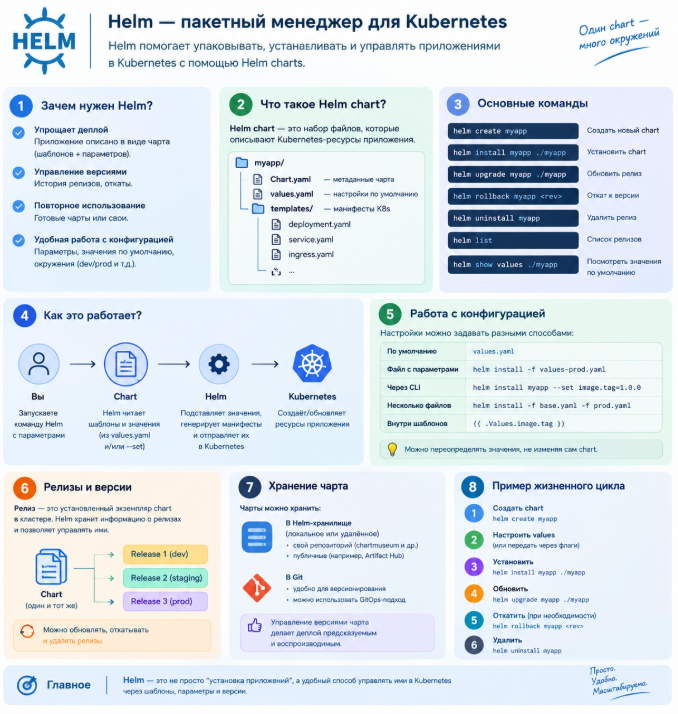

# Helm как пакетный менеджер Kubernetes
Helm решает три задачи сразу: шаблонизирует манифесты, упаковывает приложение и управляет релизами — всё это стандартизирует и автоматизирует доставку в кластер. Разберём каждую из задач подробнее:

1. **Helm как шаблонизатор манифестов.** Вместо множества почти одинаковых YAML-файлов под разные окружения — один набор шаблонов с вынесенными параметрами. Helm подставляет значения и генерирует готовые Kubernetes-манифесты. Одна база для `dev`, `staging` и `prod`: меняются только реплики, ресурсы, адреса.

2. **Helm как пакетный менеджер для Kubernetes.** Приложение упаковывается в чарт — пакет из шаблонов манифестов, дефолтных значений и метаданных. Чарт версионируется, хранится в репозитории и устанавливается в кластер в любой момент — процесс предсказуемый и воспроизводимый, как и у любого пакетного менеджера в операционных системах.

3. **Helm как менеджер релизов.** Когда чарт устанавливается в кластер, Helm создаёт релиз (`release`) — конкретный экземпляр приложения с фиксированной версией чарта и набором параметров. История каждого релиза сохраняется, что позволяет обновлять приложение, отслеживать его состояние и откатываться при необходимости.

## Как Helm доставляет приложение в Kubernetes

Работу Helm удобно представить как цепочку преобразований — от описания приложения до его запуска в кластере:



- Chart — исходное описание приложения.
- Package — версия чарта для распространения.
- Release — установленный экземпляр приложения в кластере, которым Helm управляет.

Без Helm приложение часто состоит из множества YAML:
```text
deployment.yaml
service.yaml
configmap.yaml
ingress.yaml
secret.yaml
...
```
С Helm эти Kubernetes-манифесты объединяются в единый Chart.

Зачем нужен Helm
- 📦 Упаковка приложения в единый пакет 
- ⚙️ Управление конфигурацией
- 🔄 Удобные обновления
- ↩️ Откаты изменений
- 🔢 Версионирование
- ♻️ Повторное использование одного Chart
- 🌍 Разные настройки для `dev` / `stage` / `prod`

## Основные понятия

### **Chart** — это набор файлов, описывающих Kubernetes-приложение.
```text
podinfo/
├── Chart.yaml
├── values.yaml
└── templates/
    ├── deployment.yaml
    ├── service.yaml
    └── ingress.yaml
```
Можно воспринимать Chart как **шаблон приложения**.

### **Release** — это конкретно установленный Chart в Kubernetes.

Например:
```text
Chart: podinfo
       ↓
helm install podinfo ./podinfo
       ↓
Release: podinfo
```
Один Chart можно установить несколько раз:
```text
podinfo-dev
podinfo-stage
podinfo-prod
```
То есть:
- **Chart** = шаблон
- **Release** = установленный экземпляр шаблона

## Структура Helm Chart

```bash
podinfo/
├── Chart.yaml                 # Метаданные и версия Helm Chart
├── values.yaml                # Значения конфигурации по умолчанию
├── values-prod.yaml           # Переопределения значений для production
├── README.md                  # Документация по использованию Chart
└── templates/
    ├── _helpers.tpl           # Общие шаблоны и вспомогательные функции
    ├── deployment.yaml        # Создаёт Deployment приложения
    ├── service.yaml           # Создаёт Service для доступа к приложению
    ├── serviceaccount.yaml    # Создаёт ServiceAccount для Pod'ов
    ├── ingress.yaml           # Настраивает внешний HTTP/HTTPS доступ
    ├── hpa.yaml               # Автоматическое масштабирование Pod'ов
    ├── pdb.yaml               # Защита от одновременного удаления Pod'ов
    ├── redis-configmap.yaml   # Конфигурация Redis
    ├── redis-deployment.yaml  # Deployment Redis
    ├── redis-service.yaml     # Service для доступа к Redis
    └── tests/
        ├── test-http.yaml     # Helm-тест HTTP-доступности приложения
        ├── test-cache.yaml    # Helm-тест работы Redis/cache
        ├── test-fail.yaml     # Тест обработки ожидаемого сбоя
        └── test-timeout.yaml  # Тест поведения при timeout
```

То есть Helm **не является заменой Kubernetes.**
Helm генерирует Kubernetes-манифесты и управляет их применением.


| Файл                                | Что это и для чего                                                                                                                                    |
|-------------------------------------|-------------------------------------------------------------------------------------------------------------------------------------------------------|
| **Chart.yaml**                      | Метаданные Helm Chart: имя, версия Chart, версия приложения, описание и т.д.                                                                          |
| **values.yaml**                     | Значения конфигурации по умолчанию. Шаблоны получают их через `.Values`.                                                                              |
| **values-prod.yaml**                | Значения для production, которые переопределяют настройки из `values.yaml`.                                                                           |
| **README.md**                       | Документация: установка Chart, параметры, примеры использования и т.д.                                                                                |
| **templates/_helpers.tpl**          | Общие переиспользуемые шаблоны для имён, labels и других значений. Сам Kubernetes-ресурс обычно не создаёт.                                            |
| **templates/deployment.yaml**       | Шаблон Deployment основного приложения podinfo: образ, реплики, контейнер, probes, ресурсы, переменные и т.д.                                         |
| **templates/service.yaml**          | Шаблон Service для доступа к Pod'ам приложения podinfo.                                                                                               |
| **templates/serviceaccount.yaml**   | Шаблон ServiceAccount, который может использоваться Pod'ами для взаимодействия с Kubernetes API.                                                      |
| **templates/ingress.yaml**          | Шаблон Ingress для организации внешнего HTTP/HTTPS-доступа к приложению.                                                                              |
| **templates/hpa.yaml**              | Шаблон Horizontal Pod Autoscaler (HPA) — автоматически изменяет количество реплик приложения в зависимости от нагрузки/метрик.                        |
| **templates/pdb.yaml**              | Шаблон PodDisruptionBudget (PDB) — ограничивает количество Pod'ов, которые могут быть одновременно удалены при добровольных disruption'ах.             |
| **templates/redis-configmap.yaml**  | Шаблон ConfigMap с конфигурацией Redis.                                                                                                               |
| **templates/redis-deployment.yaml** | Шаблон Deployment Redis, запускающий Redis в Kubernetes.                                                                                              |
| **templates/redis-service.yaml**    | Шаблон Service для Redis, через который podinfo обращается к Redis.                                                                                   |
| **templates/tests/test-http.yaml**  | Helm-тест, проверяющий доступность и работу HTTP-интерфейса приложения.                                                                               |
| **templates/tests/test-cache.yaml** | Helm-тест, проверяющий работу cache/Redis и взаимодействие с ним.                                                                                     |
| **templates/tests/test-fail.yaml**  | Helm-тест, проверяющий ожидаемое поведение приложения при ошибочном сценарии.                                                                         |
| **templates/tests/test-timeout.yaml** | Helm-тест, проверяющий поведение приложения при превышении времени ожидания (timeout).                                                              |


# 📚 Основные термины и определения

| Термин                        | Определение                                                                                             |
|-------------------------------|---------------------------------------------------------------------------------------------------------|
| **Helm**                      | Менеджер пакетов для Kubernetes, упрощающий установку и управление приложениями                          |
| **Чарт (Chart)**              | Пакет Helm — набор файлов, описывающих связанные ресурсы Kubernetes                                      |
| **Релиз (Release)**           | Экземпляр чарта, установленный в кластер с уникальным именем                                            |
| **values.yaml**               | Файл со значениями по умолчанию для шаблонов чарта                                                      |
| **values-prod.yaml**          | Override-файл со значениями для prod-окружения                                                          |
| **Шаблон (Template)**         | Файл с Go-шаблонами, преобразуемый Helm в Kubernetes-манифесты                                          |
| **_helpers.tpl**              | Файл с переиспользуемыми шаблонами (имена, labels, selectorLabels)                                      |
| **Revision**                  | Номер версии релиза, увеличивается при каждом `helm upgrade`                                            |
| **Hook**                      | Ресурс, выполняемый в определённый момент жизненного цикла релиза                                       |
| **Helm Test**                 | Тестовые Pod'ы, запускаемые через `helm test`                                                           |
| **PDB (PodDisruptionBudget)** | Ограничение на количество одновременно недоступных Pod'ов                                               |
| **HPA (HorizontalPodAutoscaler)** | Автоматическое масштабирование Pod'ов по метрикам                                                   |
| **LimitRange**                | Ограничения на ресурсы для Pod'ов в namespace                                                           |
| **ResourceQuota**             | Квота на общее потребление ресурсов в namespace                                                         |

## Шпаргалка с командами для работы
- `helm template ...` — рендер шаблонов локально, чтобы увидеть итоговые Kubernetes YAML без установки в кластер.
- `helm lint ...` — линтер, проверка чарта на ошибки структуры и типовые проблемы в шаблонах.
- `helm install ...` — установка нового релиза в кластер.
- `helm upgrade --install ... --wait --timeout --atomic` — безопасный деплой или обновление релиза с автоматическим ожиданием готовности и rollback при ошибке.
- `helm status / history / rollback` — просмотр состояния релиза, истории изменений и откат к предыдущей версии.
- `helm get values / manifest` — просмотр применённых values и сгенерированных манифестов для установленного релиза.
- `helm list`— просмотр всех релизов и их статуса.
- `helm get manifest <release>` — просмотр Kubernetes-манифестов, которые Helm применил в кластере.
- `helm uninstall <release>`— удаление релиза и всех связанных Kubernetes-ресурсов.

