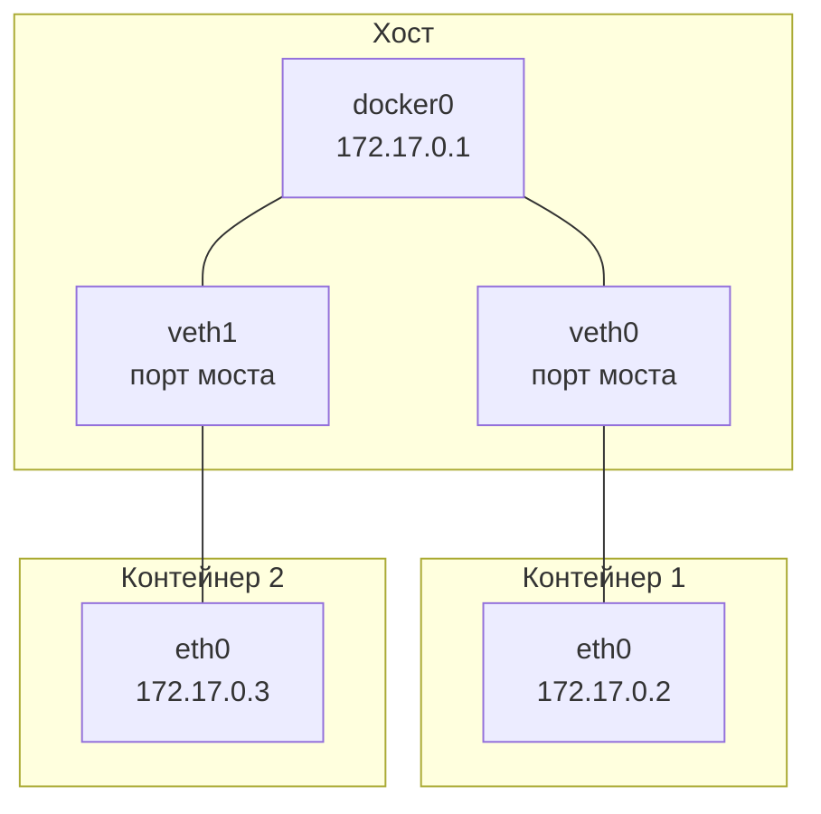

# Контейнеризация и Docker

 C одной стороны были пакеты ПО — лёгкие, но нестандартные и не обеспечивающие изоляции. С другой — виртуальные машины, обеспечивающие полную изоляцию, но тяжёлые и тоже нестандартные. Нужен был промежуточный подход, который сочетает преимущества обоих решений.

 Ответом на этот запрос стала контейнеризация. Программы стали упаковывать в стандартные пакеты, которые содержали всё необходимое для запуска: библиотеки, конфигурационные файлы, вспомогательные утилиты и другие компоненты.

 И контейнеризация стандартна. Запуск упакованных таким образом программ возможен на любом компьютере с ОС Linux совместимой архитектуры (amd64, arm64 и т.д.) или внутри ВМ с Linux. Для этого компьютер или виртуальная машина просто должны обладать достаточными вычислительными ресурсами и иметь установленный стандартный софт для работы с контейнерами.

| Виртуализация                                    | Контейнеризация                                   |
|--------------------------------------------------|---------------------------------------------------|
| Каждая ВМ имеет свою ОС                          | Все контейнеры используют ОС хоста                |
| Запуск ВМ занимает минуты                        | Запуск контейнера занимает секунды                |
| ВМ потребляют много ресурсов                     | Контейнеры легковесны                             |
| Полная изоляция                                  | Изоляция на уровне процессов                      |

 Запущенную таким образом программу называют **контейнером** (container), пакет, содержащий всё необходимое для его запуска, — **образом** контейнера (container image), систему хранения и распространения образов — **реестром** или **репозиторием** (container repository), а весь подход в целом — **контейнеризацией**.

Для выполнения практических заданий нам понадобится инструмент. Мы будем использовать **Docker** — он позволяет запускать контейнеры, создавать образы, сохранять и скачивать их из реестров.
**Docker** — одна из самых популярных систем для работы с контейнерами. Чтобы лучше понимать смысл команд в практической части урока, кратко рассмотрим архитектуру Docker.

**Docker** — это платформа для разработки, доставки и запуска приложений в изолированных контейнерах. Контейнеры позволяют упаковать приложение со всеми его зависимостями в стандартизированный образ, который можно запустить на любой системе с установленным Docker.

| Аналогия            | Docker                                                                 |
|---------------------|------------------------------------------------------------------------|
| Контейнер           | Лёгкий, изолированный "ящик" с приложением и всем необходимым для его работы |
| Образ               | "Чертеж" или "шаблон" для создания контейнера                          |
| Docker Hub          | "Магазин" готовых образов                                              |

# Архитектура Docker

Центральная часть системы — Docker Daemon `dockerd`. Это «мозг» системы, который позволяет обращаться к нему через Docker Engine API.

Рядовой пользователь никогда не использует этот API напрямую. Его инструмент — команда `docker`. Она использует API для взаимодействия с `dockerd` и предоставляет пользователю все необходимые возможности через интерфейс командной строки.

В связке с Docker Daemon работает Container Runtime `containerd` — программа, которая выполняет все низкоуровневые операции по запуску контейнеров.

Также Docker плотно взаимодействует с **реестрами контейнеров** (Container Registry). Реестры не входят в состав программного продукта Docker, но поддерживают общие с ним стандарты. Это хранилища, из которых можно загружать образы контейнеров. 

Образы контейнеров — это пакеты программ и других файлов, которые используются для создания контейнеров. Container Runtime умеет работать с реестрами, получать и загружать в них образы.

Схематично архитектуру Docker можно представить так:

```text
 ┌──────────────────────────────────────────────────────────┐
 │                                                          │
 │ ┌───────────────┐       ┌─────────────────────────┐      │
 │ │               │       │                         │      │
 │ │   Docker CLI  ├──────►│      Docker daemon      │      │
 │ │               │       │                         │      │
 │ └───────────────┘       └────────────┬────────────┘      │
 │                                      │                   │
 │                                      ▼                   │
 │                         ┌─────────────────────────┐      │         ┌─────────────────┐
 │                         │                         │      │         │    Реестры      ├─┐
 │                         │        Containerd       ├──────┼────────►│                 │ ├─┐
 │                         │                         │      │         │    образов      │ │ │
 │                         └─────┬─────────────┬─────┘      │         └──┬──────────────┘ │ │
 │                               │             │            │            └─┬──────────────┘ │
 │                               ▼             ▼            │              └────────────────┘
 │                    ┌─────────────┐    ┌─────────────┐    │
 │                    │             ├┐   │             ├┐   │
 │                    │  Containers ││┐  │  Images     ││┐  │
 │                    └─────────────┘││  └─────────────┘││  │
 │                     └─────────────┘│   └─────────────┘│  │
 │                      └─────────────┘    └─────────────┘  │
 │                                                          │
 └──────────────────────────────────────────────────────────┘
 ```

| Компонент               | Роль                    | Что делает                                                                 |
|-------------------------|-------------------------|----------------------------------------------------------------------------|
| Docker CLI              | Интерфейс пользователя  | Принимает команды от пользователя, отправляет их в Docker Daemon           |
| Docker Daemon (dockerd) | Управляющий процесс     | Обрабатывает API-запросы, управляет образами, контейнерами, сетями, томами |
| containerd              | Промышленный рантайм    | Управляет жизненным циклом контейнеров, работает с образами OCI            |
| containerd-shim         | Прокси-процесс          | Изолирует контейнер от containerd, позволяет перезапускать containerd без остановки контейнеров |
| runC                    | Низкоуровневый рантайм  | Создаёт и запускает контейнеры на уровне ядра Linux                        |


Образ — это шаблон для создания контейнера
Образ может быть скачан из реестра и сохранён на хосте
Из одного образа можно запускать множество контейнеров

`docker pull hello-world` - скачать образ

`docker image ls hello-world` - убедиться, что образ появился в локальном кеше

`docker run --name hello hello-world` - запуск контейнера

`docker ps` - просмотр всех запущенных контейнеров

`docker kill [id]` - завершить работу контейнеров

`docker container rm hello` - удалить контейнер

`docker image rm hello-world` - удалить образ с хоста


## Интерактивный запуск контейнера

Docker поддерживает запуск контейнера в интерактивном режиме. В этом режиме вы можете взаимодействовать с процессом в контейнере через его стандартный ввод и вывод.

```bash
$ docker run -it alpine
/ #
```

Изолировано:
1. Имя хоста
2. Файловая система
3. Список процессов
4. Конфигурация сети
5. Пользователи

**Контейнер** — это изолированное окружение: имя хоста, файловая система, процессы и сеть отличаются от основного хоста.
**Изоляция не абсолютна:** как минимум для процессов она действует в только в одну сторону — процессы контейнера видны на хосте через команду `ps ax`, а размеры корневой файловой системы для хоста и контейнера совпадали.

`docker ps` - список запущенных контейнеров
`docker ps -a` - список завершённых контейнеров

## docker stats: получение статистики

```text
CONTAINER ID   NAME               CPU %     MEM USAGE / LIMIT   MEM %     NET I/O     BLOCK I/O   PIDS
0a5b641c503a   strange_mahavira   0.00%     860KiB / 3.819GiB   0.02%     806B / 0B   0B / 0B     1
```

В выводе `docker stats` отображаются следующие поля:
- `CONTAINER ID` — идентификатор контейнера;
- `NAME` — имя контейнера;
- `CPU %` — загрузка CPU процессами контейнера;
- `MEM USAGE / LIMIT` — использование памяти контейнером; если лимит при запуске не задан, в качестве лимита выступает вся доступная память;
- `MEM %` — доля использования памяти в процентах;
- `NET I/O` — объём полученных и отправленных данных по сети;
- `BLOCK I/O` — объём дисковой записи и чтения данных с диска контейнером;
- `PIDS` — количество потоков исполнения в контейнере.

## docker logs: получение логов

1. **Режим по умолчанию:** процесс в контейнере отрабатывает и завершается, а мы видим его `stdout` и `stderr` в терминале.

2. **Интерактивный режим:** мы можем вводить информацию, которую процесс получит через `stdin`, и видим его `stdout` и `stderr`.

Но часто контейнеры должны работать не в открытом терминале, а в составе серверного приложения. Такой режим работы называется **фоновым** (detached). Для запуска контейнера в фоновом режиме используют опцию `-d` (`--detach`) команды `docker run`:
```bash
docker run -d IMAGE [COMMAND] 
```

Пример:
```bash
$ docker run -d alpine ping localhost
58a587d3f168377b4294cf397f6b95f93d9e72c93ed0eaf33d9ab81b38c2239b 

$ docker logs 58a587d3f168
PING localhost (127.0.0.1): 56 data bytes
64 bytes from 127.0.0.1: seq=0 ttl=64 time=0.036 ms
64 bytes from 127.0.0.1: seq=1 ttl=64 time=0.039 ms
64 bytes from 127.0.0.1: seq=2 ttl=64 time=0.044 ms
64 bytes from 127.0.0.1: seq=3 ttl=64 time=0.043 ms
64 bytes from 127.0.0.1: seq=4 ttl=64 time=0.044 ms
... 
```

## Выполнение команд в запущенном контейнере

Запустите в фоновом режиме контейнер `alpine`:
```bash
$ docker run -dt alpine
98a4d37853d0b5c0790e89c32c693ddc9dffd7b0138bf36cb26bc1faa6eb785a
```
При запуске нужно указать две опции: `-d` — запустить контейнер в фоне, и `-t` — выделить процессу псевдотерминал. Это необходимо, чтобы основной процесс контейнера — `/bin/sh` — не завершился сразу.

Как и при запуске контейнера через `docker run`, выполнять команду через `docker exec` можно в обычном и в интерактивном режиме. Для запуска интерактивного сеанса используйте параметры `-it`.
```bash
ubuntu@epd9oq5173ilbvgn5sfb:~$ docker exec -it ca1d07e8ed93 /bin/sh
/ # hostname
ca1d07e8ed93
/ #
```
Эта возможность чаще всего используется для диагностики контейнеров.
Если завершить интерактивный сеанс, контейнер продолжит работать в фоновом режиме. Чтобы его остановить, используйте команду `docker stop` или `docker kill`, после чего можно удалить: `docker rm`


### Небольшая практика:

```bash
$ docker ps -a | grep alpine
1c868a26a0bf   alpine   "/bin/sh"  19 minutes ago   Exited (0) 2 minutes ago  ## Контейнер с curl

$ docker commit 1c868a26a0bf alpine_curl
sha256:7424cb71fdfdf7abbd227dca1eba87f16e343438207d9d5ce6bce75860a2581b ## Создали новый контейнер сразу с curl

$ docker run alpine_curl curl http://wttr.in/moscow
  % Total    % Received % Xferd  Average Speed   Time    Time     Time  Current
                                 Dload  Upload   Total   Spent    Left  Speed
100  Weather report: moscow   0   8258      0  0:00:01  0:00:01 --:--:--  8264

$ docker ps -a | grep alpine_curl
b9d71524fac0   alpine_curl   "curl http://wttr.in…"  2 minutes ago   Exited (0) 2 minutes ago ## Контейнер сразу с командой 

$ docker commit b9d71524fac0 moscow_weather
sha256:0a4cdf932419a7211efe95f21c5ac11bfa5633626f38b8ef5351c9804c67bb13 ## Срздали новый контейнер сразу с командой
```

# Автоматизация сборки образа

Есть несколько конкретных реализаций, которые могут собирать образы, основываясь на текстовых программах. В Docker это делается через команду `docker build` и специальный файл, где описывается последовательность действий для изготовления образа — Dockerfile

В образе должны содержаться все файлы, которые нужны для запуска приложения. Также в образе сохраняется конфигурация, определяющая, как должен запускаться и работать контейнер, созданный на его основе. Как правило, контейнерные образы строят на основе других образов. Такой исходный образ называют **базовым**.

Информацию о базовом образе, действия, необходимые для добавления нужных файлов, а также указание, какой процесс должен запускаться при старте контейнера, записывают в Dockerfile.

Dockerfile состоит из набора инструкций, а те — из ключевого слова и параметров. Ключевые слова принято записывать в верхнем регистре. Кроме инструкций, в Dockerfile могут быть пустые строки и комментарии, которые начинаются со знака `#` и продолжаются до конца строки.

Создание образа обычно начинают с подготовки каталога, куда помещают все файлы, нужные приложению. Этот каталог со всем содержимым называется «контекстом сборки». Это важное понятие: для образа часто требуются дополнительные файлы — само приложение, ресурсы, конфигурация и т. д. Всё это и входит в такой контекст.

Затем создаётся Dockerfile.

Первой инструкцией в нём, как правило, является `FROM` — она указывает базовый образ:
```dockerfile
FROM alpine 
```

Затем добавляется инструкция `RUN`, которая говорит, что для создания образа нужно выполнить команду. В примере выше мы добавили пакет с командой `curl` — повторим это в Dockerfile:
```dockerfile
RUN apk add curl 
```

В конце добавим инструкцию `CMD`. Она указывает, какую команду нужно выполнить при запуске контейнера:
```dockerfile
CMD curl http://wttr.in/moscow 
```

В итоге получится Dockerfile с таким содержимым:
```dockerfile
FROM alpine
RUN apk add curl
CMD curl http://wttr.in/moscow 
```

Сохраним его в каталоге `weather_report` и выполним там же команду `docker build . -t weather_report`. Точка в команде `docker build .` указывает Docker на контекст сборки — текущий каталог, а `-t` задаёт имя итогового образа. Если Dockerfile находится в том же каталоге, он будет использоваться по умолчанию, а если в другом месте, путь к нему нужно указать через параметр `-f`. Мы разместили Dockerfile в каталоге `weather_report`, поэтому указывать путь к нему не нужно.

Мы получили образ `weather_report`, который можем запустить:
```bash
docker run weather_report
```

## Параметризация образа

Менять Dockerfile каждый раз, когда нам нужен другой город, неудобно. Поэтому можно использовать переменную окружения.
Добавьте переменную окружения `CITY`, чтобы сделать образ универсальным. Поменяйте Dockerfile:

Соберите образ:
```bash
docker build . -t flexible_weather_report 
```

И запустите контейнер, указав значение переменной окружения `CITY`:
```bash
docker run -e CITY=spb flexible_weather_report
```

Обратите внимание: мы не можем просто выставить переменную окружения перед вызовом `docker run`. В контейнере переменные окружения не появляются автоматически. Чтобы задать их при запуске, нужно явно указать значения с помощью параметров `-e` или `--env`.

## Параметризация на этапе сборки образа

Сделаем образ ещё более гибким. Сейчас скорость ветра в прогнозе указывается в километрах в час. Нам могут быть привычнее метры в секунду. К счастью, wttr.in позволяет выбрать нужную систему измерения в параметрах запроса. Можно указать `u` для миль в час, `m` для километров в час и `M` для метров в секунду:
```bash
curl wttr.in/msk?u # Выдаст результат в mph
curl wttr.in/msk?m # Выдаст результат в km/h
curl wttr.in/msk?M # Выдаст результат в m/s 
```

Dockerfile:
```dockerfile
FROM alpine
RUN apk add curl
ENV UNITS=M
CMD curl http://wttr.in/$CITY?$UNITS 
```

Если захочется поменять единицы измерения по умолчанию, придётся изменить Dockerfile и значение переменной окружения `UNITS`. Однако чаще удобнее оставить Dockerfile неизменным, а нужное значение передавать через параметры команды `docker build`.

Для этого нужно сделать две вещи:
1. Добавить в Dockerfile инструкцию ARG UNITS:
```dockerfile
ARG UNITS
```

2. Указать, что переменная окружения `UNITS` должна инициализироваться при сборке в значение аргумента сборки `UNITS`:
```dockerfile
ENV UNITS=$UNITS
```

В итоге изменено:
```dockerfile
FROM alpine
RUN apk add curl
ARG UNITS
ENV UNITS=$UNITS
CMD curl http://wttr.in/$CITY?$UNITS 
```

Здесь может возникнуть путаница! И аргумент сборки `UNITS`, и переменная окружения `UNITS` выглядят одинаково. Но один применяется во время сборки образа, а другой — при запуске контейнера.

|                                    | Аргумент сборки                  | Переменная окружения             |
|------------------------------------|----------------------------------|----------------------------------|
| Когда действует                    | При сборке образа                | При запуске контейнера           |
| Как задаётся в Dockerfile          | `ARG UNITS[=...]`                | `ENV UNITS=...`                  |
| Как задаётся при сборке образа     | `--build-arg UNITS=...`          | n/a                              |
| Как задаётся при запуске контейнера| n/a                              | `-e UNITS=...`                   |

Также полезно запомнить правило: если `$VAR` встречается в инструкции `CMD` (время выполнения контейнера), то она ссылается на переменную окружения времени выполнения; если же `$VAR` используется в `RUN` или `ENV` (время сборки образа), то она ссылается на аргумент сборки.
Последнее, что стоит отметить про инструкцию `ARG`: у аргумента, который описывается с её помощью, как и у переменной окружения, которая описывается через `ENV`, может быть значение по умолчанию. Мы могли бы написать так:

```dockerfile
ARG UNITS=m
ENV UNITS=$UNITS 
```
В этом случае, если мы не укажем аргумент сборки `--build-arg UNITS=...`, его значение будет `m`.

| Команда | Когда существует                          | Для чего                                                      |
|---------|-------------------------------------------|---------------------------------------------------------------|
| `ARG`   | Только во время сборки (`docker build`)   | Передать параметры в процесс сборки                          |
| `ENV`   | Во время сборки И во время работы контейнера | Передать переменные в запущенное приложение                  |

```dockerfile
# ARG — для сборки (docker build)
ARG VERSION=1.0.0
ARG REPO_URL=https://myrepo.com

# ENV — для запуска (docker run)
ENV APP_PORT=8080
ENV NODE_ENV=production

# Передаём ARG в ENV
ARG APP_VERSION=1.0.0
ENV APP_VERSION=$APP_VERSION
```

## Добавление файлов в образ

Создайте Dockerfile с таким содержанием:
```dockerfile
# Используем базовый образ python
FROM python

# Установим модуль lorem
RUN pip install --root-user-action=ignore lorem

# Создадим каталог для хранения файла с кодом нашего приложения внутри образа
RUN mkdir /app

# Скопируем файл приложения в
COPY app.py /app/

# Укажем, какую команду выполнить при запуске контейнера
CMD python /app/app.py
```

Тегом называют часть имени образа после двоеточия, на практике «тегировать образ» означает задать ему полное имя: базовое название (до двоеточия) + тег. Терминология может немного путать, но к ней нужно привыкнуть:
- **Базовое имя** — всё до двоеточия;
- **Тег** — всё после двоеточия;
- **Полное имя образа** — базовое имя + двоеточие + тег;
- **Тегирование** — присвоение образу полного имени.

## Сборочный кеш

По сравнению с предыдущим запуском видно, что образ `python` больше не скачивается, а инструкции из Dockerfile повторно не выполняются.
Вы уже знаете, что при первой сборке образ попал в кеш, поэтому во второй раз его не скачивали. Оказывается, что шаги сборки также используют специальную область, которая называется сборочным кешем. Если Docker понимает, что промежуточные шаги и файлы не менялись, он берёт результат из кеша, то использует данные из кеша.


## Сборка приложения на Go

Для следующего примера возьмём приложение, написанное на Go. Программы на Go компилируются в исполняемый файл — в отличие от Python-скриптов, которые интерпретируются. И это по-разному влияет на процесс сборки контейнера с приложением.

Пока всё было похоже на сборку контейнера со скриптом на Python. Однако GO — компилируемый язык. В результате компиляции командой `go build` создаётся исполняемый файл `app`. Он не использует динамические библиотеки и является самостоятельным исполняемым файлом.

```bash
ubuntu@epd9oq5173ilbvgn5sfb:~/game$ docker run --rm game ls -lh /app/app
-rwxr-xr-x 1 root root 2.1M Jul 29 08:32 /app/app

ubuntu@epd9oq5173ilbvgn5sfb:~/game$ docker image ls game
IMAGE         ID             DISK USAGE   CONTENT SIZE   EXTRA
game:latest   3569791133c8       1.27GB          312MB    U
```

Размер файла — около двух мегабайт. А размер образа около 1.2Гб. Получается, что вычислительные ресурсы тратятся впустую: в итоговом образе наше приложение занимает всего два мегабайта, а всё остальное — это система сборки, которая была нужна только один раз, при создании образа.

Тут на помощь приходит многостадийная (multi-stage) сборка. Мы делим сборку на два этапа: на первом делаем наше приложение, на втором — создаём облегчённый образ, который будет использоваться для запуска контейнера. В качестве такого образа можно взять и небольшой `alpine`, ещё меньший `busybox` или специальный образ `scratch` («пустой» образ без единого файла).

```Dockerfile
FROM golang:1.23 AS builder
WORKDIR /app
RUN go mod init app
COPY app.go .
RUN go build -o /app/app

FROM scratch
COPY --from=builder /app/app /app/app
CMD ["/app/app"] 
```

Параметром `AS` мы задали имя первой стадии сборки — `builder`. После сборки приложения добавили вторую стадию: ещё одну инструкцию `FROM`, на этот раз с образом `scratch`.

Название сборочного образа `builder` мы используем в инструкции `COPY`, указывая через параметр `--from`, откуда нужно копировать файлы.
Соберём образ:

```bash
ubuntu@epd9oq5173ilbvgn5sfb:~/game$  docker build . -t game

ubuntu@epd9oq5173ilbvgn5sfb:~/game$ docker image ls game
IMAGE         ID             DISK USAGE   CONTENT SIZE   EXTRA
game:latest   03bc8bd9af55        3.5MB         1.33MB
```

Теперь размер образа составляет всего два мегабайта — в нём только наше приложение. Такой образ намного эффективнее использует ресурсы сети и хранилища.

## Базовые инструкции Dockerfile с их назначением

| Инструкция | Назначение                                                                                     | Пример                                          |
|------------|------------------------------------------------------------------------------------------------|-------------------------------------------------|
| `FROM`     | Задает базовый образ, с которого начинается сборка. **Всегда первая инструкция**.                   | `FROM alpine:3.18`                              |
| `WORKDIR`  | Устанавливает рабочую директорию для следующих инструкций (`RUN`, `CMD`, `COPY`). Если папки нет — создает. | `WORKDIR /app`                                  |
| `COPY`     | Копирует файлы и папки с хост-машины в образ.                                                  | `COPY . /app`                                   |
| `ARG`      | Объявляет переменную, которая доступна только во время сборки (`docker build`).                | `ARG VERSION=1.0`                               |
| `ENV`      | Устанавливает переменную окружения, которая доступна во время сборки и во время работы контейнера. | `ENV NODE_ENV=production`                       |
| `RUN`      | Выполняет команду во время сборки образа. Используется для установки пакетов, создания файлов и т.д. | `RUN apt-get update && apt-get install -y curl`|
| `CMD`      | Задает команду, которая выполняется при запуске контейнера (`docker run`). Может быть переопределена. | `CMD ["node", "app.js"]`                        |

# Использование файловой системы в контейнерах

Контейнерный образ содержит файлы, необходимые для работы процесса, запущенного в контейнере. При запуске контейнера создаётся файловая система, которая будет видна контейнеризованному процессу как корневая.

Если процесс создаст или изменит файлы в своей файловой системе, эти новые или изменённые файлы будут существовать только пока существует контейнер. Файловая система контейнера эфемерна: она создаётся на базе образа и уничтожается при удалении контейнера.

Во многих случаях процессы в контейнере используют файлы из образа и не создают новых. Но есть случаи, когда процесс создаёт или изменяет данные, которые должны сохраняться вне контейнера, либо использует файлы, которых нет в образе. Например, в контейнере может быть запущен сервер БД: файлы с данными должны жить значительно дольше, чем сам контейнер.

Другой пример — контейнеризованные приложения для компиляции программ из исходного кода. В этом случае приложение в контейнере (компилятор) должно иметь доступ к исходному тексту программ и возможность сохранить результат своей работы так, чтобы им можно было воспользоваться вне контейнера.

В таких случаях используют механизм внешних томов (volumes), который позволяет разделять файлы между контейнером и хостом или между несколькими контейнерами.

## Разделяемые каталоги

В простейших случаях использование контейнеризованных приложений сводится к запуску контейнера, возможному взаимодействию с приложением через стандартный ввод и вывод и завершению работы контейнера. При этом мы просто получаем результат работы программы в стандартный вывод. Если результатом работы контейнера должен быть единичный файл, мы просто можем перенаправить стандартный вывод.

С помощью опции `-v` (`--volume`) можно монтировать части файловой системы хоста в контейнер, делая их доступными как внутри контейнера, так и вне его. Синтаксис этой опции следующий: мы указываем строку, состоящую из имени каталога файловой системы хоста, двоеточия и имени каталога в файловой системе контейнера.

```bash
ubuntu@epd9oq5173ilbvgn5sfb:~$ mkdir new_dir
ubuntu@epd9oq5173ilbvgn5sfb:~$ docker run -v $PWD/new_dir:/some_dir -it alpine
/ # echo "Hello from container" > /some_dir/hello.txt
/ # exit
ubuntu@epd9oq5173ilbvgn5sfb:~$ cat new_dir/hello.txt
Hello from container
```
## Сохранение данных между запусками

Calcure — приложение с Text User Interface (TUI), объединяющее в себе календарь со списком событий и таск-лист. Сконфигурированные задачи и дела сохраняются в текстовых файлах, что позволяет сохранять данные между запусками.

*Почему пропала задача после перезапуска контейнера?*

Задача была сохранена в файловой системе контейнера; при запуске нового контейнера создалась новая файловая система, в которой не было этой задачи
Контейнер использует эфемерную файловую систему. Данные, записанные внутрь контейнера, удаляются вместе с ним. Проблема не в приложении, а в отсутствии volume.
Но мы знаем, как сохранять данные в файловой системе хоста с помощью томов.

Calcure сохраняет данные в каталоге ~/.config/calcure. Создайте каталог для данных и примонтируйте его в контейнер при запуске:

```bash
$ mkdir data
$ docker run -it -v $PWD/data:/root/.config/calcure calcure
```

Создайте задачу и выйдите из приложения. Затем запустите контейнер снова, не забыв указать опцию `-v`. Задача останется на месте.
Проверьте содержимое каталога data на хосте:
```bash
$ ls data/
config.ini  events.csv  info.log  tasks.csv

ubuntu@epd9oq5173ilbvgn5sfb:~/calcure/data$ cat events.csv
1,2026,8,10,"DOCKER",1,once,normal
```

## Именованные тома

Использование каталога для сохранения данных может быть неудобным, потому что каждый раз при запуске контейнера нужно указывать полный путь к каталогу. Мы должны помнить, где создали каталог, и заботиться о его создании и сохранности. Иногда конкретный путь не важен: требуется просто том для сохранения данных.

Docker позволяет создавать именованные тома. Мы задаём имя тома при создании, а при запуске контейнера мы указываем его имя в опции `-v`.
```bash
$ docker volume create calcure_data
calcure_data

$ docker run -it -v calcure_data:/root/.config/calcure calcure
```

Именованные тома отличаются от каталогов, используемых для хранения данных:

- именованные тома управляются системой Docker через параметры команды `docker volume`;
- они создаются в системной области, пользователь не принимает непосредственного участия в их создании;
- Docker следит за использованием тома: если он используется в каком-либо контейнере, удалить его нельзя.

Параметры именованного тома можно просмотреть командой `docker volume inspect`:
```bash
$ docker volume inspect calcure_data
[
    {
        "CreatedAt": "2025-07-12T14:36:30Z",
        "Driver": "local",
        "Labels": null,
        "Mountpoint": "/var/lib/docker/volumes/calcure_data/_data",
        "Name": "calcure_data",
        "Options": null,
        "Scope": "local"
    }
] 
```

Обладая достаточными правами, можно просмотреть содержимое тома:
```bash
$ sudo ls /var/lib/docker/volumes/calcure_data/_data/
config.ini  events.csv  info.log  tasks.csv
```
Если том больше не нужен, его можно удалить его командой `docker volume rm`. Но если есть контейнер, использующий том, Docker не позволит это сделать:

```bash
ubuntu@epd9oq5173ilbvgn5sfb:~$ docker volume rm calcure_data
Error response from daemon: remove calcure_data: volume is in use - [8103f2c5bb09dc31257b7a3a93f8499393f59d73f93807210fe350596d33ecd8, 3ed880e9ea959f96ad6dc9ffd7f0605b9a4ea973b4dedd54ea32504a0dc74720]
```
Одна из возможностей томов, которая может оказаться полезной, — монтирование только на чтение. Не всегда нужно, чтобы контейнеризованный процесс мог изменять данные в томе: иногда достаточно доступа только на чтение. При этом ограничить запись только файловыми правами не всегда удобно, потому что по умолчанию процессы в контейнере часто запускаются от имени пользователя `root`.

В Docker том можно смонтировать только на чтение:
```bash
$ docker run -it -v calcure_data:/root/.config/calcure:ro calcure
```

После добавления `:ro` процесс сможет просматривать содержимое тома, но не модифицировать его.

## Компиляция исходного кода

Разделяемые тома — полезная концепция, и её можно применять не только для хранения данных приложений.

В практике автоматизации сборки и деплоя программных продуктов часто применяются вспомогательные контейнеры, которые содержат либо компиляторы нужных версий, либо утилиты — линтеры, служебные программы для деплоя и так далее.

Общее для этих случаев: процесс в контейнере использует данные с хоста и создаёт результат, который нужен на следующих шагах сборки и деплоя (например, собранные выполняемые модули).

Чаще всего такой подход применяется в следующих случаях:

- для компилируемых языков, если получившиеся исполняемые файлы будут использоваться не в контейнерах;
- когда результат работы — текстовые файлы (например, отчёты о работе линтера);
- когда нужный результат — вообще не файлы, а выполнение действий (например, настройка инфраструктуры).

## Запуск линтера

Линтер — программа, которая проверяет корректность исходного кода. Линтеры часто используются в процессе разработки ПО для автоматических проверок.
Использование контейнеров позволяет избежать необходимости установки и настройки линтеров на файловую систему хоста.

Создайте каталог и файл `hello.py`:
```python
#!/usr/bin/env python3

prefix="Hello, "

def hello(who):
    print(prefix + who)

hello("devops") 
```

Запустите линтер:
```bash
$ docker run --rm -v $(pwd):/data cytopia/pylint hello.py
************* Module hello
hello.py:1:0: C0114: Missing module docstring (missing-module-docstring)
hello.py:3:0: C0103: Constant name "prefix" doesn't conform to UPPER_CASE naming style (invalid-name)
hello.py:5:0: C0116: Missing function or method docstring (missing-function-docstring)

-----------------------------------
Your code has been rated at 2.50/10 
```

Исправьте замечания линтера:
```python
#!/usr/bin/env python3
""" Greeting script """

PREFIX="Hello, "

def hello(who):
    """ hello() greets anyone """
    print(PREFIX + who)

hello("devops") 
```
Запустите линтер снова:
```bash
$ docker run --rm -v $(pwd):/data cytopia/pylint hello.py

------------------------------------
Your code has been rated at 10.00/10 
```

# Использование томов на практике

Мы рассмотрели, как работают тома, но как они используются на практике? В реальной жизни тома используются в контейнеризации в следующих ситуациях:
- хранение данных базами данных: процесс СУБД работает в контейнере, а персистентность обеспечивается размещением данных на томе;
- логирование работы: процесс в контейнере пишет логи в файл, и этот файл размещается на внешнем томе;
- применение в разработке: код располагается в каталоге, который монтируется как том, а средства разработки запускаются в контейнере;
- обмен данными между контейнерами: например, контейнер с web-сервером отдаёт статические файлы, которые генерирует приложение в другом контейнере (этот приём будет использоваться в финальной практической работе);
- загрузка файлов пользователя: если нужно загрузить большой набор файлов, их можно сложить в каталог и смонтировать его в контейнер с загрузчиком;
- монтирование конфигурационных файлов: часто с помощью томов монтируются конфигурационные файлы для приложений, работающих в контейнерах;
- бэкапы и миграции данных: процесс в контейнере работает с данными, которые монтируются через внешний том.

**Слой** — это неизменяемый (read-only) набор файлов, который является результатом выполнения одной инструкции в Dockerfile.

```dockerfile
FROM alpine:3.18        # Слой 1: базовый образ
RUN apk add curl        # Слой 2: установка curl
COPY app.py /app/       # Слой 3: копирование кода
CMD python app.py       # Слой 4: метаданные (не создаёт файлов)
```

| Директория   | Что содержит                        | Доступ                        |
|--------------|-------------------------------------|-------------------------------|
| `LowerDir`   | Базовые слои образа                 | Read-only                     |
| `UpperDir`   | Изменения, сделанные в контейнере   | Read-write                    |
| `MergedDir`  | Объединённый вид всех слоёв         | Read-write (для процессов)    |
| `WorkDir`    | Служебная директория                | Internal                      |

| Особенность              | Что значит                                                                 |
|--------------------------|----------------------------------------------------------------------------|
| Copy-on-Write (COW)      | При изменении файла он копируется из нижнего слоя в верхний перед записью |
| Слои не изменяются       | Нижние слои никогда не меняются — только перекрываются верхними           |
| Размер образа            | Сумма размеров всех слоёв                                                 |
| Кеш сборки               | Если слой не изменился — используется из кеша                             |


**Ваша задача:** запустить Redis в контейнере, сохранить в нём некоторые данные, потом перезапустить контейнер и получить эти данные снова. Как вы можете предположить, данные должны сохраняться во внешний том. Известно, что путь, по которому сервер сохраняет данные — `/data`.

```bash
docker volume create redis-data
docker run -d --name redis -v redis-data:/data redis
docker exec -it redis redis-cli set devops "save the planet"
docker stop redis && docker rm redis
docker run -d --name redis -v redis-data:/data redis
docker exec -it redis redis-cli get devops  # "save the planet" ✅
```

# Использование сети в контейнерах

Контейнеры изолируют приложение вместе с его зависимостями, поэтому версии библиотек и чужие пакеты на хосте ему не мешают. Но в сети такой изоляции нет: если несколько сервисов на одном хосте пытаются слушать один и тот же порт, они конфликтуют. В микросервисной архитектуре, где на одной виртуальной машине работают десятки сервисов, обслуживающих запросы по стандартным протоколам (например, HTTP/HTTPS), их корректная совместная работа в сети становится отдельной задачей.

## Вводная информация о сетевых возможностях Linux

Прежде чем разбираться, как устроена сеть в контейнерах, перечислим сетевые механизмы Linux, которые Docker использует при создании контейнера:

- сетевой интерфейс,
- маршрутизация,
- трансляция адресов,
- правила `netfilter`,
- виртуальный мост,
- сетевая пара `veth`,
- сетевое пространство имён.

Разберём каждый из них чуть подробнее.

### Сетевой интерфейс

Сетевой интерфейс принимает и отправляет пакеты. В его драйвере есть две очереди: входящих пакетов (RX) и исходящих (TX). При передаче или получении данных интерфейс обращается к драйверу сетевой карты (NIC), который работает с физической сетью.
В системе есть особый интерфейс `loopback`, не связанный ни с одним физическим устройством. Обычно он называется `lo`. Всё, что передаётся через lo, автоматически попадает в очередь на получение на этом же интерфейсе. Его используют для обмена пакетами между приложениями на одном и том же хосте (например, когда две локальные программы общаются друг с другом по сети).

### Маршрутизация

Ключевой компонент маршрутизации — таблица маршрутов. Она содержит правила, определяющие, какой интерфейс будет использоваться для отправки пакета. В таблице есть блоки адресов назначений (пара «адрес сети + маска подсети») и соответствующие им сетевые интерфейсы.

Когда пакет нужно маршрутизировать, ядро сравнивает его адрес назначения с правилами в таблице маршрутов и выбирает подходящий интерфейс.

Обычно в таблице есть запись маршрута по умолчанию. Если ни одно правило не подошло, пакет отправляется через интерфейс, указанный в этой записи.

Просмотреть таблицу маршрутов можно командой `ip route show`.

### Трансляция адресов

У IP-пакета есть адрес источника и адрес назначения. В архитектуре ipv4 часто применяется концепция «приватных адресов сетей», для которых в глобальном интернете нет маршрутов. Хосты в таких сетях могут связываться с сервисами в Интернет через механизм трансляции адресов.

### Правила `netfilter`

Подсистема `netfilter` работает, пропуская пакет через цепочку правил. С пакетом можно сделать главное: пропустить (`ACCEPT`), отбросить (`DROP` или `REJECT`), переписать адрес источника или назначения (`SNAT`, `DNAT`, `MASQUERADE`). Есть и другие правила (`REDIRECT`, `LOG`, `MARK`, `RETURN`), но их мы пока разбирать не будем.
Наибольший интерес в контексте Docker и контейнеризации представляют правила, переписывающие адреса источника или назначения.

Docker использует два типа правил:

- `MASQUERADE` — переписывает адрес источника у пакетов из контейнера перед их отправкой в сеть. Приватный внутренний адрес заменяется на адрес реального сетевого интерфейса хоста, чтобы ответы корректно вернулись в контейнер. MASQUERADE похож на SNAT, но SNAT рассчитан на статический адрес, а MASQUERADE работает с динамически меняющимся адресом интерфейса.

- `DNAT` — переписывает адрес назначения при получении пакета. Здесь пакет, предназначенный приложению в контейнере, может прийти как из внешней сети, так и от приложения на хосте — в обоих случаях его обработают правила DNAT.

Правила `netfilter` также используются Docker для изоляции контейнеров из разных Docker-сетей (через правила `DROP`).

### Виртуальный мост

Он представляет собой виртуальный сетевой интерфейс с IP-адресом, к которому «подключают» другие интерфейсы хоста. Подключённые интерфейсы сохраняют свои MAC-адреса, но больше не имеют собственных IP: в этом состоянии они считаются портами моста (не путать с TCP/UDP-портами).

Такой мост объединяет все подключённые интерфейсы в один виртуальный сегмент: устройства могут напрямую обмениваться фреймами, зная только адреса канального уровня. Интерфейс виртуального моста также имеет свой MAC-адрес и подключается через свой виртуальный порт.

Для работы с виртуальными мостами используются команды `bridge` и `brctl`. 

### Сетевая пара `veth`

Сетевая пара — это два интерфейса, которые логически объединены одним виртуальным сегментом: пакет, отправленный в один, приходит на второй. Такие пары можно создавать динамически, например командой `ip link add`:

```bash
ip link add veth0 type veth peer name veth1 
```

В Docker при запуске контейнера создаётся сетевая пара. Один из интерфейсов пары подключается к виртуальному мосту (то есть становится портом), и его сегмент объединяется с другими. Так контейнеры получают возможность напрямую взаимодействовать друг с другом.
Виртуальному сегменту моста будет соответствовать отдельная IP-подсеть.

### Сетевое пространство имён

Последняя сущность, с которой нужно познакомиться ближе — сетевое пространство имён. Это средство создания виртуальных сетевых стеков в пределах одного хоста или виртуальной машины. Каждый виртуальный стек имеет собственную таблицу маршрутизации, свои правила `netfilter` и свой набор сетевых интерфейсов.
У каждого пространства имён будет свой loopback-интерфейс `lo`. Это очень важно: хотя везде он имеет адрес `127.0.0.1`, в разных пространствах имён эти интерфейсы никак не связаны логически.

## Общий процесс настройки контейнерной сети

Docker создаёт несколько контейнерных сетей. Перечень существующих можно увидеть командой `docker network ls`. По умолчанию их три: `bridge`, `host` и `none` (если не указано явно, то используется bridge).

- При выборе `null` контейнеры стартуют в отдельном сетевом пространстве имён, где есть только интерфейс lo.
- При выборе `host` сетевое пространство имён не создаётся — контейнер работает в основном пространстве хоста.
- Если используется `bridge`, для каждого контейнера создаётся отдельное пространство имён, которое подключается к виртуальному мосту посредством сетевой пары `veth`.

Как правило, контейнеры запускаются в сети `bridge`. Рассмотрим её подробнее.



**Docker** создаёт виртуальный мост, контейнеры подключаются к нему через сетевые пары veth, получая свои IP-адреса — так они общаются друг с другом и с внешним миром.