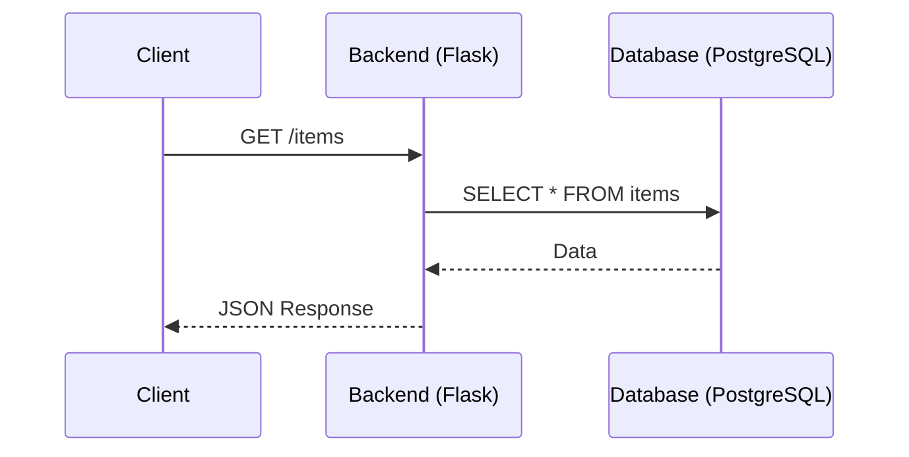

# Backend

**Backend (бэкенд)** — это серверная часть веб-приложения, которая отвечает за:

- Обработку запросов от клиента (frontend)
- Бизнес-логику приложения
- Работу с базами данных
- Аутентификацию и авторизацию
- Интеграцию с внешними сервисами

**Backend (серверная часть)** — это «подкапотная» часть веб-приложения, скрытая от пользователя. Она отвечает за логику, хранение данных, безопасность и взаимодействие с другими сервисами.

Главная цель: Обработать запрос клиента, выполнить бизнес-логику, сохранить/получить данные и вернуть корректный ответ.


### Пример простого запроса

```text
Пользователь открывает сайт https://example.com/users/123

Frontend:
  └─ отправляет GET запрос на backend

Backend:
  └─ получает запрос
  └─ проверяет права доступа
  └─ идёт в базу данных
  └─ находит пользователя с id=123
  └─ формирует ответ (JSON)
  └─ отправляет обратно

Frontend:
  └─ получает данные
  └─ отображает страницу с информацией
```

### Основные компоненты Backend

```text
┌─────────────────────────────────────────────────────────┐
│                    Клиент (Frontend)                    │
└────────────────────────┬────────────────────────────────┘
                         │ HTTP/HTTPS
                         ↓
┌─────────────────────────────────────────────────────────┐
│                   Web Server (Nginx/Apache)             │
│  - Принимает запросы                                    │
│  - Статические файлы                                    │
│  - Балансировка нагрузки                                │
└────────────────────────┬────────────────────────────────┘
                         │
                         ↓
┌─────────────────────────────────────────────────────────┐
│              Application Server (Flask/Django)          │
│  - Обрабатывает запросы                                 │
│  - Выполняет бизнес-логику                              │
│  - Общается с БД                                        │
└────────────────────────┬────────────────────────────────┘
                         │
                         ↓
┌─────────────────────────────────────────────────────────┐
│                     База данных                         │
│  - PostgreSQL / MySQL / MongoDB                         │
│  - Хранит данные пользователей                          │
│  - Хранит состояние приложения                          │
└─────────────────────────────────────────────────────────┘
```

## Архитектура Backend-приложений

Веб работает по принципу **Request-Response Cycle**:
1. Client (Browser/Mobile App) отправляет HTTP-запрос.
2. Server (Backend) принимает запрос, обрабатывает его.
3. Database (опционально) хранит или отдает данные.
4. Server формирует ответ (обычно JSON или HTML) и отправляет обратно клиенту.

**Ключевые протоколы**
- **HTTP/HTTPS:** Основной протокол веба. Без состояния (stateless).
- **WebSocket:** Двусторонняя постоянная связь (чаты, онлайн-игры).
- **TCP/IP:** Фундаментальный протокол передачи данных в сетях.

### Монолитная архитектура

Всё приложение собрано в одном исполняемом файле.

```
┌────────────────────────────────────────┐
│            Монолитное приложение       │
│  ┌─────────┐ ┌─────────┐ ┌─────────┐   │
│  │  API    │ │ Бизнес- │ │   БД    │   │
│  │  слои   │ │ логика  │ │  слой   │   │
│  └─────────┘ └─────────┘ └─────────┘   │
└────────────────────────────────────────┘
```
Плюсы:
- Простота разработки
- Простота деплоя
- Простота тестирования

Минусы:
- При росте — сложность поддержки
- Любое изменение требует передеплоя всего приложения
- Масштабирование только целиком

### Микросервисная архитектура

Приложение разбито на маленькие независимые сервисы.
```
┌──────────┐    ┌──────────┐    ┌──────────┐
│ Сервис   │    │ Сервис   │    │ Сервис   │
│ Пользова-│◄──►│ Заказы   │◄──►│ Платежи  │
│ телей    │    │          │    │          │
└──────────┘    └──────────┘    └──────────┘
      │               │               │
      └───────────────┼───────────────┘
                      ↓
              ┌──────────────┐
              │  API Gateway │
              └──────────────┘
```
Плюсы:
- Масштабирование отдельных сервисов
- Независимый деплой
- Разные технологии для разных сервисов

Минусы:
- Сложность разработки
- Сетевое взаимодействие между сервисами
- Распределённые транзакции

## API (Application Programming Interface)

**API (Application Programming Interface)** — это контракт между программами, который описывает, как они могут взаимодействовать друг с другом.
Способ общения между клиентом и сервером или между сервисами.

- **REST (Representational State Transfer):**
    - Использует стандартные HTTP-методы: `GET` (получить), `POST` (создать), `PUT/PATCH` (обновить), `DELETE` (удалить).
    - Ресурсы идентифицируются URL (например, `/users/1`).
    - Stateless (сервер не хранит состояние клиента между запросами).
- **GraphQL:**
    - Клиент запрашивает именно те данные, которые ему нужны, одним запросом.
    - Решает проблемы over-fetching (лишние данные) и under-fetching (нехватка данных).
- **gRPC:**
    - Высокопроизводительный RPC-фреймворк от Google.
    - Использует Protocol Buffers (бинарный формат). Идеален для микросервисов внутри системы.


### HTTP — основа современного веба
**HTTP (HyperText Transfer Protocol)** — протокол передачи гипертекста. Это правила и формат, по которому клиент и сервер общаются.

```
Клиент                                Сервер
   │                                    │
   │  1. HTTP-запрос                    │
   │  ────────────────────────────────► │
   │     "Дай мне информацию"           │
   │                                    │
   │  2. Сервер обрабатывает запрос     │
   │                                    │
   │  3. HTTP-ответ                     │
   │  ◄──────────────────────────────── │
   │     "Вот твои данные"              │
   │                                    │
```


### Структура HTTP запроса
```
GET /api/users/123?fields=name,email HTTP/1.1
Host: example.com
Authorization: Bearer token123
Content-Type: application/json
User-Agent: MyApp/1.0
```

### Структура HTTP ответа
```
HTTP/1.1 200 OK
Content-Type: application/json
Content-Length: 123

{
  "id": 123,
  "name": "Иван",
  "email": "ivan@example.com"
}
```

| Часть             | Значение                               | Пример                          |
|-------------------|----------------------------------------|---------------------------------|
| **Метод**         | Действие, которое нужно выполнить      | `GET`, `POST`, `PUT`, `DELETE`  |
| **Path**          | Ресурс, с которым работаем             | `/api/users/123`                |
| **Query String**  | Параметры для фильтрации/пагинации     | `?fields=name&page=2`           |
| **HTTP Version**  | Версия протокола                       | `HTTP/1.1` или `HTTP/2`         |
| **Headers**       | Мета-информация о запросе              | `Authorization`, `Content-Type` |
| **Body**          | Данные запроса (для POST, PUT)         | `{"name": "Иван"}`              |

### HTTP Статус-коды

```yaml
2xx - Успех:
  200 OK: Всё хорошо
  201 Created: Ресурс создан
  204 No Content: Успех, но нет данных в ответе

3xx - Перенаправление:
  301 Moved Permanently: Ресурс перемещён навсегда
  304 Not Modified: Не изменилось (кеш)

4xx - Ошибка клиента:
  400 Bad Request: Неверный запрос
  401 Unauthorized: Не авторизован
  403 Forbidden: Запрещено (нет прав)
  404 Not Found: Не найдено
  422 Unprocessable Entity: Не прошло валидацию

5xx - Ошибка сервера:
  500 Internal Server Error: Ошибка на сервере
  502 Bad Gateway: Проблемы с прокси
  503 Service Unavailable: Сервер перегружен
```

##  Flask - микрофреймворк для Python

**Flask** — это микрофреймворк для создания веб-приложений на Python.

Особенности:
- **«Микро»:** Не включает встроенную ORM, валидацию форм или админку. Только ядро (роутинг, запросы, ответы).
- **Гибкость:** Вы сами выбираете библиотеки для БД, авторизации и т.д.
- **Werkzeug:** WSGI-тулкит, лежащий в основе Flask (обрабатывает HTTP).
- **Jinja2:** Шаблонизатор для генерации HTML (если нужен SSR).

*Почему Flask? Легковесный, быстрый старт, отличный выбор для микросервисов и небольших API. Для крупных Enterprise-проектов чаще выбирают Django (batteries included) или FastAPI (асинхронность, типизация).*

### Структура Flask-приложения

```
myapp/
├── app.py              # Главный файл приложения
├── requirements.txt    # Зависимости
├── static/            # Статические файлы (CSS, JS)
│   └── style.css
├── templates/         # HTML шаблоны
│   └── index.html
└── venv/              # Виртуальное окружение
```



**API** — это контракт между разными программами
**REST** — популярный стиль проектирования API (6 принципов)
**HTTP протокол** предоставляет методы (GET, POST, PUT, DELETE), статус-коды, заголовки
**Stateless** — каждый запрос содержит всю информацию для выполнения
**Ресурсы** определяются через URL (/users/123)
**Идемпотентность** важна для надёжности (PUT, DELETE — идемпотентны)
**Версионирование** помогает эволюционировать API
**Документация** (OpenAPI/Swagger) необходима для удобства использования

## Важные концепции и термины

- **Stateless vs Stateful**:
    - *Stateless*: Сервер не помнит предыдущие запросы (REST). Масштабируется легко.
    - *Stateful*: Сервер хранит состояние (сессии, WebSocket). Сложнее масштабировать.
- **Cache (Кэширование)**: Временное хранение часто запрашиваемых данных (в памяти или Redis) для ускорения ответа и снижения нагрузки на БД.
- **Load Balancer (Балансировщик нагрузки)**: Распределяет входящие запросы между несколькими серверами (Nginx, HAProxy).
- **CI/CD:** Непрерывная интеграция и доставка. Автоматизация тестирования и деплоя кода.
- **Docker:** Контейнеризация приложения. Гарантирует, что код работает одинаково везде («работает на моей машине» → «работает в продакшене»).
- **12-Factor App:** Методология построения SaaS-приложений (конфиги в env, состояние вне процесса, логи как потоки событий и т.д.).