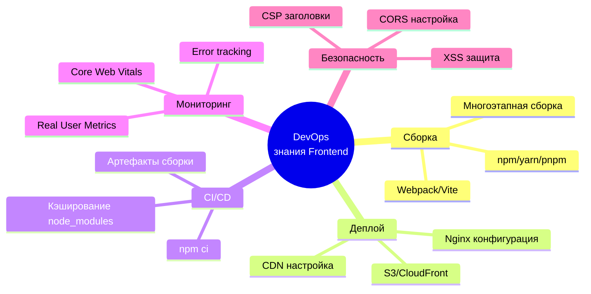

# Frontend для DevOps-инженера
**Frontend** (клиентская часть) — это всё, что выполняется в браузере пользователя. Для DevOps-инженера критически важно понимать, как frontend собирается, доставляется и работает в production.

## Основные технологии

```marmeid
graph TB
    subgraph "Frontend Stack"
        HTML[HTML<br/>Структура]
        CSS[CSS<br/>Стили]
        JS[JavaScript<br/>Логика]
    end
    
    HTML --> Browser[Браузер]
    CSS --> Browser
    JS --> Browser
    
    Browser --> Render[Рендеринг страницы]
```

## Базовые понятия:

- **HTML** (HyperText Markup Language) — Скелет и DOM. HTML — это язык разметки, который определяет структуру и семантику документа. Он говорит браузеру: «Это заголовок», «Это параграф», «Это кнопка». Когда браузер получает HTML-файл, он не просто отображает его. Он проходит этап Парсинга (Parsing):
    1. Браузер читает байты HTML.
    2. Преобразует их в токены (теги, атрибуты, текст).
    3. Строит DOM (Document Object Model) — древовидную структуру объектов в памяти.
**Что такое DOM Tree?**
Это программное представление HTML-страницы. Каждый тег становится «узлом» (Node) в дереве.
    - `<html>` — корень.
    - `<head>` и `<body>` — дети корня.
    - Внутри `<body>` лежат `<div>`, `<p>` и т.д.

- **CSS (Cascading Style Sheets)** — Внешний вид и CSSOM. CSS отвечает за визуальное представление элементов DOM: цвета, шрифты, отступы, расположение (layout), анимации.
Процесс обработки CSS сложнее, чем кажется:
  1. Браузер скачивает CSS-файлы (или читает встроенные стили).
  2. Парсит их и строит CSSOM (CSS Object Model).
  3. CSSOM — это тоже дерево, но оно отражает иерархию стилей и их специфичность (вес селекторов).

- **JavaScript** — Интерактивность и управление. JavaScript (JS) — язык программирования, который позволяет изменять DOM и CSSOM динамически, реагировать на действия пользователя (клики, ввод) и общаться с сервером (API).

- **DOM** (Document Object Model) — программный интерфейс к HTML
- **SPA** (Single Page Application) — приложение загружается один раз, далее динамическое обновление

| Технология | Что делает                | Блокирует ли рендер?                     | Как оптимизировать на уровне инфраструктуры?                                 |
|------------|---------------------------|------------------------------------------|------------------------------------------------------------------------------|
| HTML       | Структура (DOM)           | Да (пока не скачается)                   | Сжатие Gzip/Brotli, быстрый TTFB, HTTP/2 Push (редко)                        |
| CSS        | Стили (CSSOM)             | Да (критично!)                           | Inline Critical CSS, асинхронная загрузка остального, кэширование           |
| JS         | Логика                    | Да (если в `<head>` без `defer/async`)   | `defer/async` атрибуты, Code Splitting, долгий TTL кэша с хэшами в именах файлов |

Понимание этого процесса поможет тебе правильно настраивать nginx.conf, выбирать стратегии кэширования и диагностировать проблемы с производительностью («почему сайт грузится 5 секунд?»).


## Место Frontend в архитектуре

```marmeid
graph LR
    subgraph "Клиентская сторона"
        A[Браузер] --> B[HTML]
        A --> C[CSS]
        A --> D[JavaScript]
        A --> E[Статические файлы]
    end
    
    subgraph "Сеть"
        F[CDN]
        G[Load Balancer]
    end
    
    subgraph "Серверная сторона"
        H[Web Server<br/>Nginx/Apache]
        I[App Server<br/>Flask/Django]
    end
    
    D --> F
    E --> F
    F --> H
    H --> G
    G --> A
```

## Почему DevOps должен знать Frontend? 

| Аспект            | Почему важно для DevOps                                              |
|-------------------|----------------------------------------------------------------------|
| Сборка            | Настроить билд-процесс (webpack, vite, npm scripts)                  |
| Контейнеризация   | Создать эффективные Docker-образы для фронта                         |
| Деплой            | Настроить CDN, кэширование, static hosting                           |
| CI/CD             | Прогнать тесты, линтеры, собрать артефакты                           |
| Мониторинг        | Отслеживать ошибки в браузерах, метрики производительности           |
| Безопасность      | Настроить CSP, CORS, защиту от XSS                                   |
| Масштабирование   | Организовать отдачу статики через Nginx/CDN                          |

## HTML — структура страницы

### Базовая структура

```html
<!DOCTYPE html>
<html lang="ru">
<head>
    <meta charset="UTF-8">
    <meta name="viewport" content="width=device-width, initial-scale=1.0">
    <title>Мой сайт</title>
    <link rel="stylesheet" href="styles.css">
    <link rel="icon" href="favicon.ico">
</head>
<body>
    <header>
        <nav>Меню навигации</nav>
    </header>
    
    <main>
        <article>Основной контент</article>
        <aside>Боковая панель</aside>
    </main>
    
    <footer>Подвал сайта</footer>
    
    <script src="script.js"></script>
</body>
</html>
```

**Важные элементы для DevOps**

| Элемент                         | Назначение                 | DevOps-нюанс                                          |
|---------------------------------|----------------------------|-------------------------------------------------------|
| `<meta charset="UTF-8">`        | Кодировка                  | Без него кракозябры                                   |
| `<meta name="viewport">`        | Адаптивность               | Без него моб. версия не работает                      |
| `<link rel="preload">`          | Предзагрузка               | Ускоряет загрузку критических ресурсов                |
| `<script defer>`                | Отложенная загрузка        | Не блокирует рендеринг                                |
| `<link rel="modulepreload">`    | Предзагрузка модулей       | Для современных JS-приложений                         |

## Что DevOps НУЖНО знать о фронтенде



## Сравнение технологий сборки

| Инструмент | Тип               | Популярность | Когда использовать                |
|------------|-------------------|--------------|-----------------------------------|
| npm        | Менеджер пакетов  | 99%          | Всегда                            |
| Webpack    | Сборщик           | Высокая      | Сложные приложения                |
| Vite       | Сборщик           | Растёт       | Современные проекты               |
| Parcel     | Сборщик           | Средняя      | Прототипы                         |
| Rollup     | Сборщик           | Средняя      | Библиотеки                        |

Команды, которые должен знать DevOps:

```bash
# Проверка зависимостей
npm audit                    # проверка уязвимостей
npm outdated                 # устаревшие пакеты
npm ci                       # чистая установка (для CI)

# Сборка
npm run build                # production сборка
npm run preview              # локальный просмотр сборки

# Анализ
npm run analyze              # анализ размера бандла
npx lighthouse URL           # аудит производительности
npx webpack-bundle-analyzer stats.json

# Деплой
aws s3 sync dist/ s3://bucket --delete
vercel --prod
netlify deploy --prod
```

### Главные выводы
1. **Фронтенд — это не просто "картинки"**. Это полноценное приложение со своей сборкой, тестами и деплоем.
2. **DevOps отвечает за инфраструктуру фронта:** CDN, Nginx, кэширование, безопасность.
3. **Ключевые команды:** npm ci, npm run build, npm run test.
4. **Важные метрики:** время загрузки, размер бандла, Core Web Vitals.
5. **Безопасность:** CORS, CSP, заголовки безопасности — ответственность DevOps.
6. **CI/CD для фронта** не сложнее, чем для бэка: установка зависимостей → сборка → тесты → деплой.
7. **Docker многоэтапная сборка** — стандарт для фронтенда.Главные выводы
